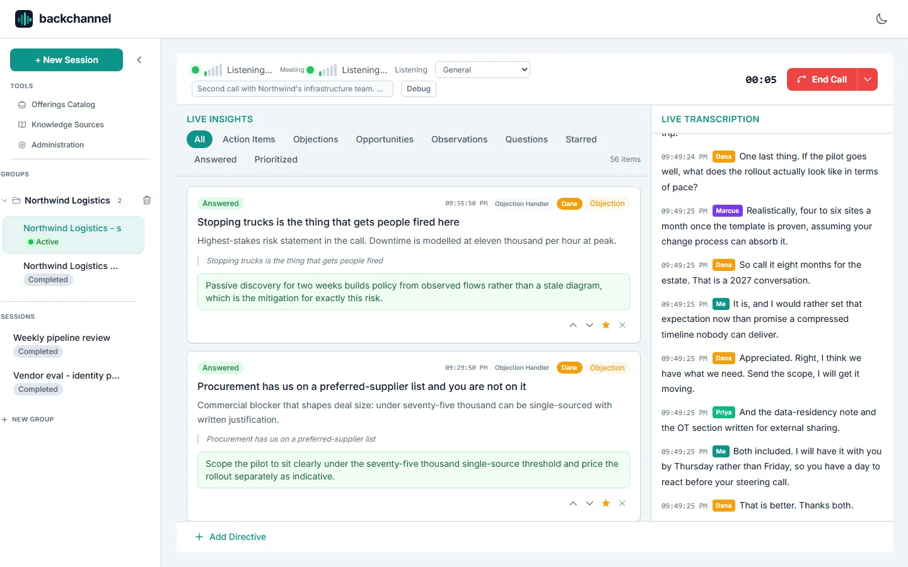
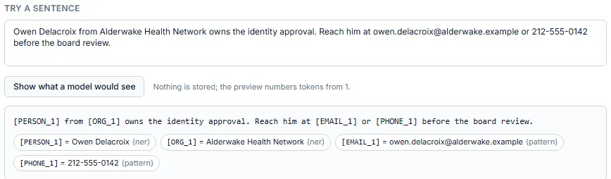
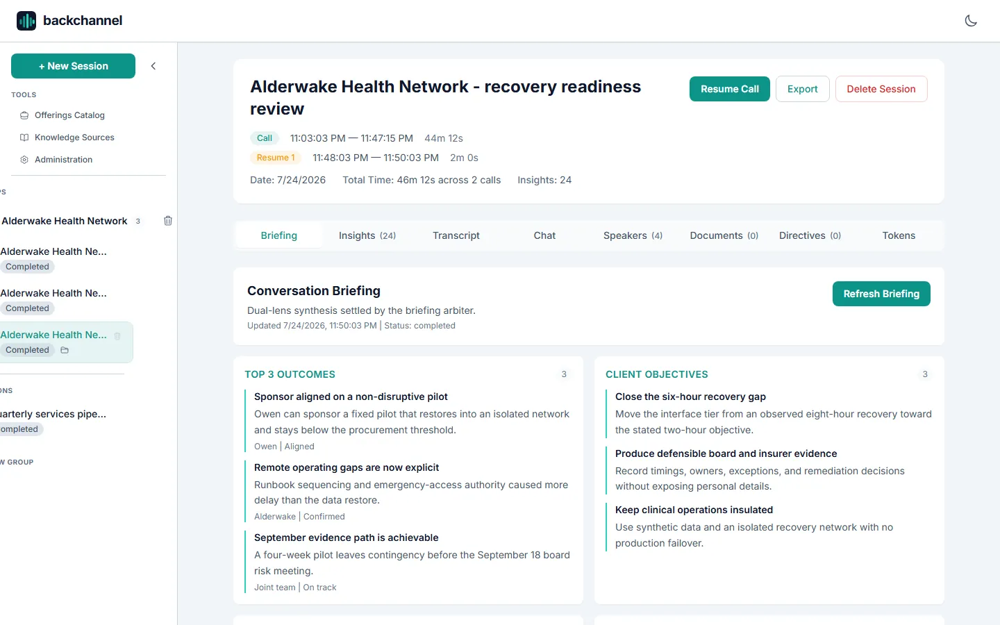
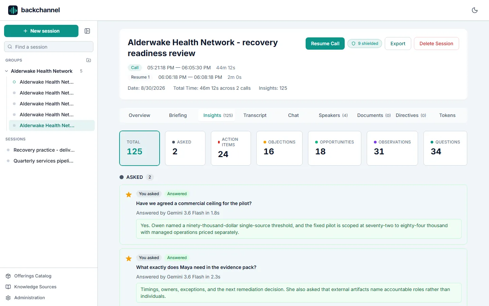
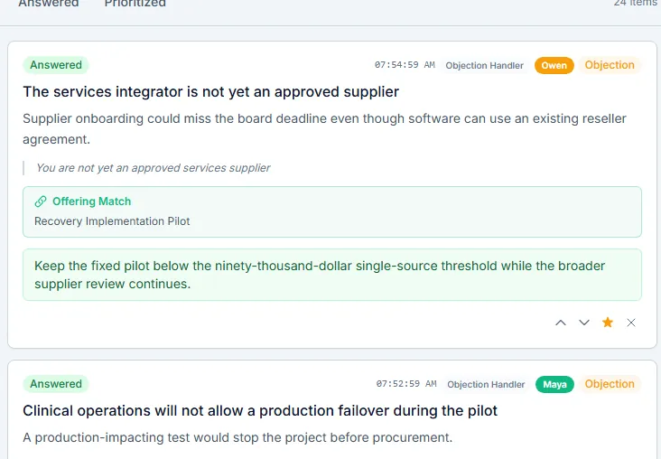
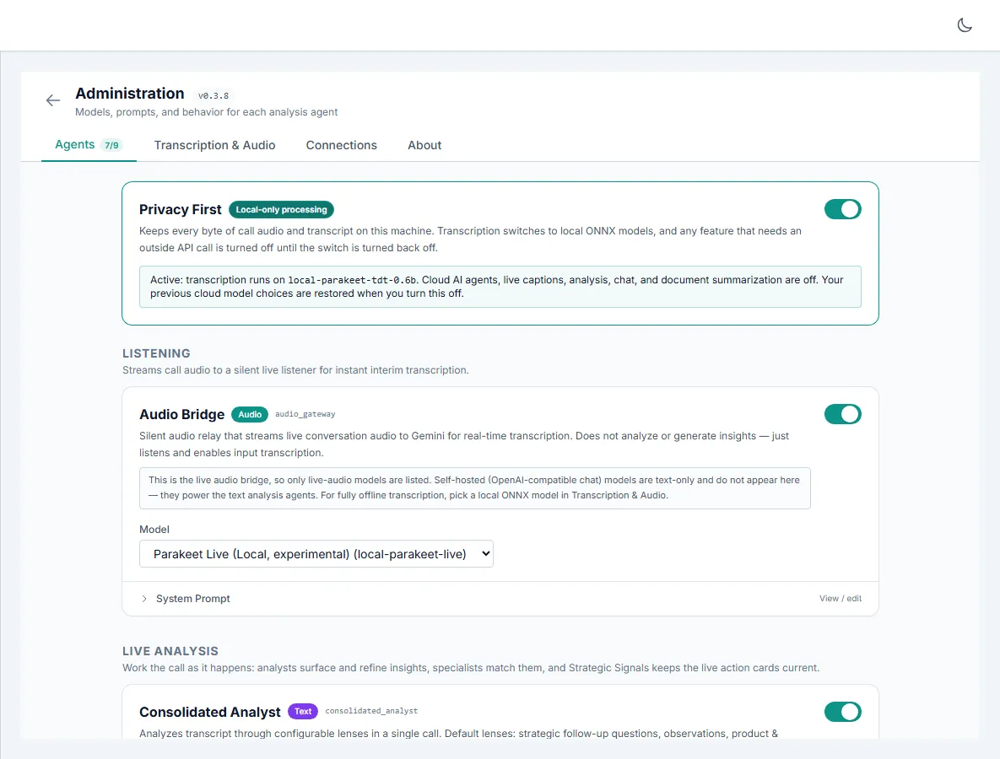
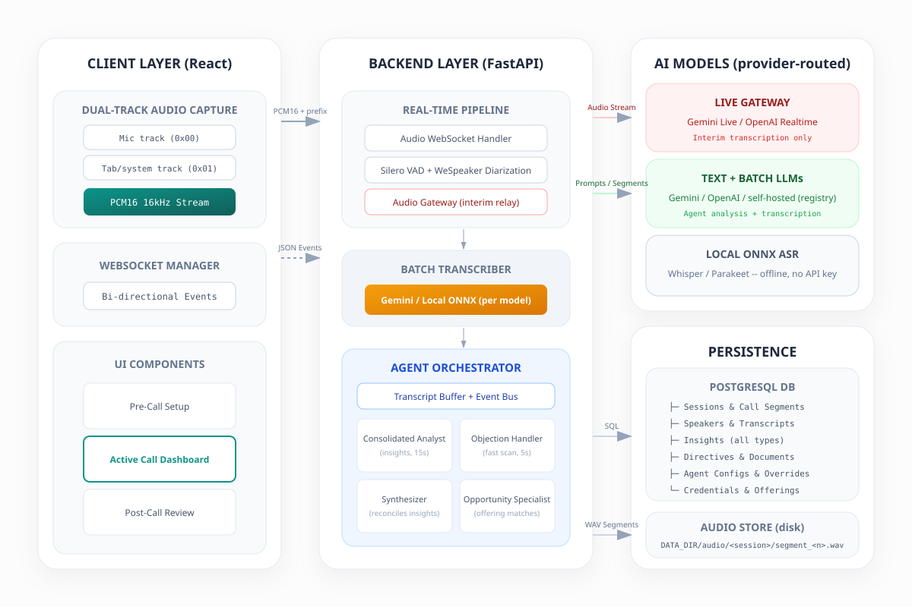

<p align="center">
  
</p>

<p align="center">
  <strong>Real-time meeting transcription and AI insight generation.</strong>
</p>

<p align="center">
  <a href="#run-it">Run it</a> -
  <a href="#features">Features</a> -
  <a href="#what-it-looks-like">Screenshots</a> -
  <a href="#architecture">Architecture</a> -
  <a href="https://backchannel.page/docs/">Documentation</a>
</p>

---

Backchannel is a self-hosted, open-source (MIT) AI meeting assistant that
runs on your own hardware -- no bot joins your call, and your audio never
leaves your infrastructure except for the model API calls you configure.

It listens to your meetings and works quietly in the background. It
captures microphone and system audio in the browser, streams it to a FastAPI
backend that builds a live speaker-attributed transcript, and runs a crew of
AI agents over the conversation as it happens -- surfacing the questions you
should ask, the objections you need to handle, and the opportunities and
action items you would otherwise reconstruct from memory afterwards.

<p align="center">
  <picture>
    <source media="(prefers-color-scheme: dark)" srcset="site/assets/shots/live-call-dark.webp" />
    
  </picture>
</p>

<p align="center">
  <em>A live call: signals across the top, a question asked and answered mid-call, the attributed
  transcript running beside it. Every screenshot here comes from a fictional demo workspace seeded
  by <code>showcase/seed_demo.py</code>.</em>
</p>

## Features

- **Live diarized transcription** -- Silero VAD plus WeSpeaker ResNet152
  speaker embeddings segment speech and attribute every line to a speaker, with
  interim text streaming in seconds ahead of the final transcript
- **Agent-based analysis** -- a consolidated analyst, a low-latency objection
  handler, a synthesizer, an opportunity specialist, and a live Strategic
  Signals agent run on their own triggers and push insights to the UI mid-call.
  Signals are kept with how often each recurred instead of being overwritten by
  the next cycle
- **Ask the call mid-conversation** -- the command bar answers from the live
  transcript, the insights raised so far, strategic signals, directives, and
  attached document summaries, without stopping the recording. The answer is
  saved with the call, starred, and exported with everything else; you choose
  which model answers, including a local one
- **Post-call briefings** -- two briefing lenses draft the factual record and
  the broader discovery view, and an arbiter settles them into a meeting
  briefing after End Call or on demand, with owners resolved to speaker names
- **Provider-routed models** -- mix Google Gemini and OpenAI models per
  agent, or register any number of self-hosted OpenAI-compatible servers
  (LM Studio, Ollama, vLLM, LiteLLM) and pick their models by name. With
  local ONNX Whisper/Parakeet handling transcription, that runs the whole
  pipeline on your own hardware with no API key from anyone -- and because
  Privacy First recognizes endpoints on your machine or network, you can
  leave the switch on and keep the agents working
- **PII Shield** -- names, companies, contact details and identifiers are
  replaced with tokens such as `[PERSON_1]` the moment they are written, so
  every model prompt, local or cloud, and the database itself hold only
  tokens. The real values sit in an encrypted vault on the machine and are put
  back only on your screen; detection is entirely on-device, and the switch
  tells you honestly which audio paths it cannot cover
- **Nothing chosen on your behalf** -- a fresh install seeds no cloud model.
  Every agent starts unselected, models are grouped by Google, OpenAI, and
  local, and one role-appropriate recommendation is marked in each provider you
  actually have available
- **Dual-track audio** -- mic and tab/system audio are captured separately,
  so remote participants get their own speaker identities, and a short voice
  calibration clip keeps your own lines attributed to you
- **Import and re-transcription** -- bring in existing transcripts (`.txt`,
  `.md`, `.docx`) or audio files (`.mp3`, `.m4a`, `.wav`, `.ogg`, `.flac`),
  and replay any recorded call through a different transcription model later
- **Meeting context** -- directives (standing or mid-call), uploaded
  documents, speaker roles, and an offerings/knowledge catalog all feed
  agent prompts
- **Exports and chat** -- transcript TXT, insights XLSX, and summary HTML
  exports, plus cross-session Q&A grounded in each meeting's briefing,
  saved insights, and speaker-attributed transcript
- **Encrypted credentials** -- provider API keys are stored encrypted at
  rest and managed from the Admin panel

## What it looks like

<picture>
  <source media="(prefers-color-scheme: dark)" srcset="site/assets/shots/pii-preview-dark.webp" />
  
</picture>

**What the model actually reads.** With the PII Shield on, a name never reaches
a model, local or cloud -- and the shield will show you, sentence by sentence,
exactly what it hands over.

<table>
<tr>
<td width="50%" valign="top">

<picture>
  <source media="(prefers-color-scheme: dark)" srcset="site/assets/shots/postcall-briefing-dark.webp" />
  
</picture>

**The briefing.** Two lenses draft in parallel, an arbiter settles them, and the
page opens with the whole meeting in five seconds.

</td>
<td width="50%" valign="top">

<picture>
  <source media="(prefers-color-scheme: dark)" srcset="site/assets/shots/postcall-insights-dark.webp" />
  
</picture>

**Every insight, kept.** 125 from one 46-minute call, each attributed to who
said it and exportable as one enriched workbook.

</td>
</tr>
<tr>
<td width="50%" valign="top">

<picture>
  <source media="(prefers-color-scheme: dark)" srcset="site/assets/shots/live-answered-dark.webp" />
  
</picture>

**Objections, handled.** Every 10 seconds over the freshest 90 seconds of
speech, with a response you can say out loud.

</td>
<td width="50%" valign="top">

<picture>
  <source media="(prefers-color-scheme: dark)" srcset="site/assets/shots/admin-agents-dark.webp" />
  
</picture>

**The crew, configurable.** Ten agents, each with its own model, prompt, and
trigger -- and a Privacy First switch that judges the destination.

</td>
</tr>
</table>

## How Backchannel compares

Live in-call assistance is no longer rare -- Otter, Zoom, and the revenue
intelligence vendors all ship some form of it. What differs is the mechanism
and the deployment: Backchannel runs a configurable crew of agents you can
re-prompt and re-model yourself, on hardware you own, with no bot in the
meeting and no per-seat license.

Sourced, dated comparisons against the tools people evaluate alongside it
live at
[backchannel.page/open-source-meeting-assistants](https://backchannel.page/open-source-meeting-assistants/),
which indexes the full set. The most common starting points:

- [Backchannel vs Meetily](https://backchannel.page/vs-meetily/) -- the
  closest open-source, local-first alternative
- [Otter alternative](https://backchannel.page/otter-alternative/) -- including
  how Otter's Live Assist compares
- [Granola alternative](https://backchannel.page/granola-alternative/) --
  bot-free capture without the hosted backend

## Architecture



The browser streams PCM16 16 kHz audio over a WebSocket. The backend
diarizes it, transcribes each segment, persists speaker-attributed
transcript entries to PostgreSQL, and feeds the text to an agent
orchestrator whose insights stream back to the UI over the same socket. A
parallel Gemini Live (or OpenAI Realtime) session provides interim
transcription while the batch pipeline produces the durable record.

Read more in [docs/architecture.md](docs/architecture.md).

## Run it

### Option 1: Desktop app (easiest)

Download the latest desktop release for your platform from the
[Backchannel download portal](https://downloads.backchannel.page/).
Downloads are open to everyone; no account, GitHub identity, or repository
membership is needed. Public release notes for the current version are linked
from the [backchannel.page](https://backchannel.page/) landing page and shown
in-app under Admin -> About.

- `Backchannel-windows-x64.zip` - unzip, run `Backchannel.exe`.
  Windows SmartScreen will warn on first run because the build is
  unsigned: click "More info" then "Run anyway".
- `Backchannel-macos-arm64.zip` (Apple Silicon) - unzip, right-click
  `Backchannel.app` and choose "Open" the first time (unsigned build).
- `Backchannel-linux-x64.tar.gz` (x64) - a portable bundle, not a
  package-manager installer: `tar -xzf Backchannel-linux-x64.tar.gz`,
  then run `Backchannel/Backchannel`.

The app lives in your system tray / menu bar and opens Backchannel in your
default browser. Data is stored per-user (`%LOCALAPPDATA%\Backchannel` on
Windows, `~/Library/Application Support/Backchannel` on macOS,
`~/.local/share/backchannel` on Linux).

Notes:
- The Windows and Linux bundles ship their own ffmpeg, so compressed audio
  imports (MP3, M4A) and browser-recorded voice-calibration clips work out
  of the box; only the macOS bundle needs a system `ffmpeg` on PATH.
- The optional Sortformer (Enhanced) diarizer is not bundled; the desktop
  app uses the built-in lightweight diarizer. Use the Docker setup if you
  want Sortformer.

### Option 2: Docker (isolated)

Keeps everything in containers, includes the optional Sortformer diarizer,
and doesn't touch your environment - at the cost of installing Docker and a
couple of extra setup steps.

Requires Docker with the Compose plugin. The default pipeline uses a free
[Gemini API key](https://ai.google.dev/) for transcription and agents.
For a setup that needs no key at all, pair local ONNX Whisper/Parakeet
transcription with a self-hosted endpoint for the agents
(see [Configuration](docs/configuration.md#self-hosted-endpoints)).

```bash
git clone https://github.com/talberthoule/backchannel.git
cd backchannel
cp .env.example .env   # set GEMINI_API_KEY (or add keys later in Admin -> Connections)
docker compose up --build
```

- App: http://localhost:3000
- Backend API: http://localhost:8001 (OpenAPI docs at `/docs`)

On a host with an NVIDIA GPU, enable GPU diarization with the override:

```bash
docker compose -f docker-compose.yml -f docker-compose.gpu.yml up -d --build
```

Full setup options (local development, migrations, GPU validation) are in
[docs/quickstart.md](docs/quickstart.md) and
[docs/deployment.md](docs/deployment.md).

## Documentation

| Page | What it covers |
| --- | --- |
| [Quickstart](docs/quickstart.md) | Docker Compose, local development, migrations, tests |
| [Getting API Keys](docs/api-keys.md) | Step-by-step Gemini and OpenAI key setup |
| [Architecture](docs/architecture.md) | The live call path end to end, frontend and backend structure |
| [Agent System](docs/agents.md) | Each agent's trigger and purpose, configuration and overrides |
| [Audio Pipeline](docs/audio-pipeline.md) | Capture format, VAD/diarization, transcription routing, audio storage |
| [WebSocket Protocol](docs/websocket-protocol.md) | Binary audio framing and every message type on `/ws/{session_id}` |
| [REST API](docs/rest-api.md) | Endpoint reference for every router |
| [Configuration](docs/configuration.md) | Settings, environment variables, credentials, model registry |
| [Deployment](docs/deployment.md) | Compose services, GPU support, nginx proxying, startup behavior |

## Tech stack

| Layer | Technology |
| --- | --- |
| Frontend | React 18, TypeScript, Vite, Tailwind CSS, served by nginx |
| Backend | FastAPI, SQLAlchemy (async), Alembic, PostgreSQL 16 |
| AI providers | Google Gemini (Live + Flash), OpenAI (GPT-5.x, Realtime), any OpenAI-compatible server |
| Local inference | Silero VAD, WeSpeaker ResNet152, Whisper/Parakeet via ONNX Runtime |

## License

[MIT](LICENSE)
