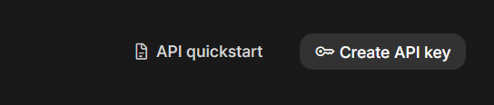
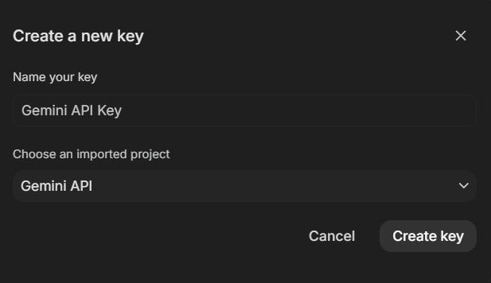

# Getting API Keys

Backchannel's transcription and analysis agents run on cloud models from
Google (Gemini) and OpenAI. This page walks through creating a key for each
provider with as few clicks as possible, then connecting it to Backchannel.

You only need one key to start:

| Provider | Needed for | Cost to start |
| --- | --- | --- |
| Google (Gemini) | Batch transcription, live interim transcription, and the default analysis agents -- start here | Free tier, no credit card |
| OpenAI | Optional; only for agents you point at OpenAI models (for example the audio gateway on OpenAI Realtime) | Prepaid credit, minimum $5 |

Prefer not to use a cloud provider at all? Turn on
[Privacy First mode](configuration.md#privacy-first-local-only-mode) under
Administration to transcribe with local models instead.

## Google Gemini key (about 2 minutes, free)

1. Open <https://aistudio.google.com/apikey> and sign in with any Google
   account.
2. Click **Create API key** in the top-right corner:

   

3. In the dialog, keep the suggested name and project (AI Studio creates a
   Google Cloud project for you if you have none) and click **Create key**:

   

4. Copy the key (it starts with `AIza`).

That is the whole process. The free tier needs no credit card and is enough
to evaluate Backchannel. You can return to the same page any time to re-copy
or revoke the key.

One caveat: managed Google Workspace accounts sometimes have AI Studio
disabled by an administrator. If the page refuses to load or the button is
missing, use a personal Google account or ask your admin to enable it.

## OpenAI key (optional)

1. Open <https://platform.openai.com/api-keys> and sign in, or create an
   account -- this is the OpenAI developer platform, which is separate from
   ChatGPT.
2. Click **Create new secret key**, give it a name such as `backchannel`,
   and copy it immediately -- OpenAI shows the full key only once. It starts
   with `sk-`.
3. API usage is prepaid and separate from any ChatGPT subscription. If
   requests fail with a quota error, add credit (minimum $5) under
   <https://platform.openai.com/settings/organization/billing>.

## Connect the key to Backchannel

1. In Backchannel, open **Admin -> API Keys**. The first-run checklist's
   **Add API key** button lands in the same place, and each provider row has
   a **Get a key** link back to the pages above.
2. Paste the key into the provider's **Paste API key...** field and click
   **Save**. Saving stores the key encrypted at rest and immediately runs a
   connection test.
3. A green **Connected** badge means you are done. An orange **Not
   verified** badge means the test has not passed yet -- click **Test** and
   read the message underneath.

Saved keys are shown only as a masked fingerprint and are encrypted with a
workspace master key; see
[API credentials](configuration.md#api-credentials) for how storage and the
environment fallback work.

### Environment fallback

For scripted or containerized setups, copy `.env.example` to `.env` and set
`GEMINI_API_KEY` (and optionally `OPENAI_API_KEY`) before starting the
stack. Keys saved in Admin -> API Keys take precedence over environment
variables.

## Keep the key safe

Treat an API key like a password: anyone holding it can spend your quota.
Do not commit it to a repository, paste it into chat tools, or share
screenshots that include it. If a key leaks, revoke it on the provider page
(both consoles support deleting a key) and save a replacement in
Admin -> API Keys.

## Troubleshooting

- **Test fails immediately** -- re-copy the key; a missing character or a
  trailing space is the usual cause. Save again and retest.
- **Gemini: 403 or "API key not valid"** -- the key may belong to a Google
  Cloud project without the Generative Language API enabled. Keys created
  through AI Studio (the steps above) enable it automatically; keys created
  manually in the Google Cloud console may not.
- **OpenAI: 429 or "insufficient_quota"** -- the account has no API credit.
  Add prepaid credit under Billing and retry; a ChatGPT subscription does
  not include API credit.
- **Provider models greyed out in Backchannel** -- an unverified failing key
  disables that provider's models. Fix or replace the key and click **Test**
  until the badge shows **Connected**.
